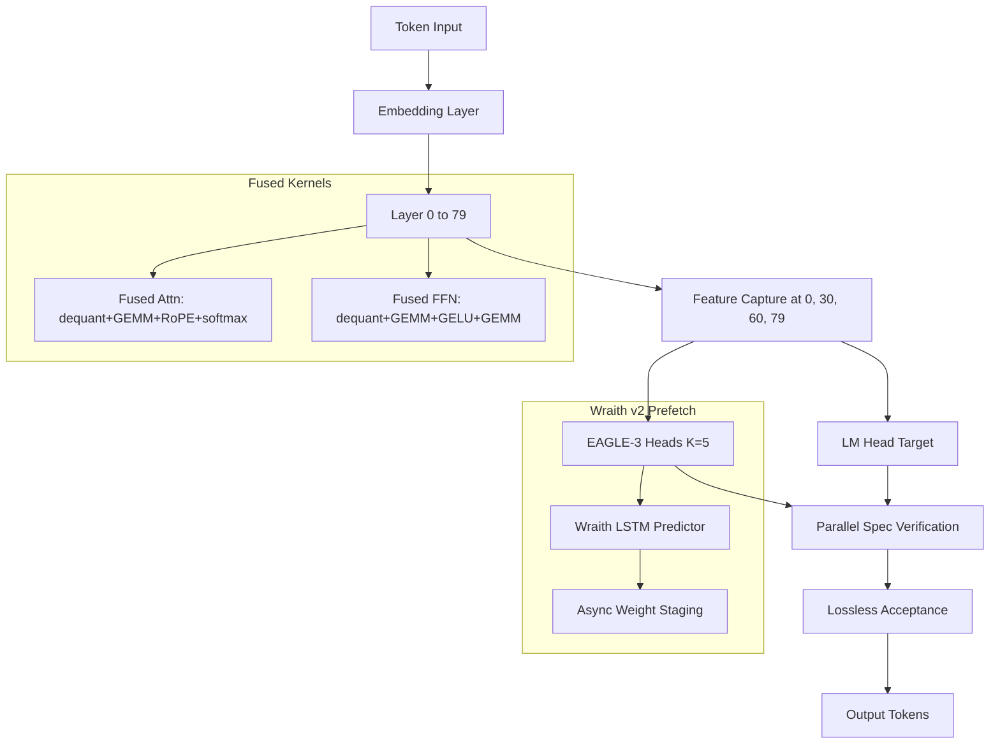

# PHANTOM v2: Full MD Blueprint Implementation Plan

**Strategic pivot:** The three root MD files ([`PHANTOM_Research_Analysis.md`](PHANTOM_Research_Analysis.md), [`PHANTOM_Quick_Reference.md`](PHANTOM_Quick_Reference.md), [`PHANTOM_v2_Implementation_Blueprint.md`](PHANTOM_v2_Implementation_Blueprint.md)) are adopted as the **primary engineering directive**. ADR-015's subsystem purge is **superseded** by ADR-016 (to be written) — Wraith prefetch, kernel fusion, and EAGLE-3 are reinstated as first-class v2 components.

**User rationale:** The MD blueprint's stacked optimizations (speculation + fusion + prefetch + quantization) target higher absolute tok/s than the current ADR-014 draft-model-only path.

---

## Why the MD Path Targets Higher Speed

The MD files identify a **multiplicative speedup stack** the current codebase does not yet implement:

```
Baseline (model-dependent)
  × Kernel fusion          (+6–12% per Quick Reference Phase 1)
  × Prefetch overlap       (+10–15% Wraith hit rate gains)
  × Selective Q3 MLPs      (+15–20% weight traffic reduction)
  × Adaptive sparsity 40%  (+5–10% conservative)
  × EAGLE-3 speculation    (+2.5–3.0× at 70–75% acceptance)
  ─────────────────────────────────────────
  → 14+ tok/s on models where baseline is ~5 tok/s (blueprint math)
```

The existing ADR-014 path (0.5B draft + CPU GEMM) proves amortization at the **layer micro-benchmark** level but lacks EAGLE-3's higher acceptance rates, fused kernels, and prefetch overlap — the MD stack's main gains.

---

## Codebase Starting Point

### Reusable today (keep and extend)

| Component | File(s) | Role in MD plan |
|---|---|---|
| Speculative engine scaffold | [`python/phantom/speculative/engine.py`](python/phantom/speculative/engine.py) | Refactor to EAGLE-3 verification loop |
| Lossless acceptance | [`python/phantom/speculative/acceptance.py`](python/phantom/speculative/acceptance.py) | Keep unchanged |
| KV rollback cache | [`python/phantom/speculative/kv_cache.py`](python/phantom/speculative/kv_cache.py) | Keep unchanged |
| GGUF loader + tiered placement | [`python/phantom/loader/`](python/phantom/loader/) | Target model loading |
| Byte accounting | [`python/phantom/instrumentation/byte_counter.py`](python/phantom/instrumentation/byte_counter.py) | Prefetch + spec profiling |
| Capacity planner | [`python/phantom/phantom_cli.py`](python/phantom/phantom_cli.py) `plan` | VRAM budget for EAGLE heads (~50 MB) |
| MoE routing | [`tests/test_moe_routing.py`](tests/test_moe_routing.py) | MoE 30B speed path (already 12.95 tok/s) |

### Must rebuild (purged under ADR-015, required by MD blueprint)

| Component | MD source | Rebuild target |
|---|---|---|
| EAGLE-3 heads | Blueprint §1.3–1.6 | `python/phantom/speculative/eagle_heads.py` |
| Triton fused attention | Blueprint §2.2 | `kernels/attention/fused_attention.py` (Triton) |
| Triton fused FFN | Blueprint §2.3 | `kernels/ffn/fused_ffn.py` (Triton) |
| Wraith v2 prefetch | Blueprint §3.1–3.2 | `python/phantom/prefetch/wraith_v2.py` |
| Selective Q3 quantization | Quick Reference Phase 2 | `python/phantom/quant/selective_q3.py` |
| Adaptive sparsity gates | Research Analysis Part 1 | `python/phantom/sparsity/adaptive_gate.py` |

### Repurpose (not discard)

- [`python/phantom/speculative/draft_runner.py`](python/phantom/speculative/draft_runner.py) → fallback `--spec-mode draft` for Medusa/EAGLE-2 prototyping per Quick Reference ("start with Medusa for 4-week MVP")
- [`python/phantom/speculative/target_verifier.py`](python/phantom/speculative/target_verifier.py) → integrate with fused kernels + batched verification
- [`scratch/bench_gemm_vs_gemv.py`](scratch/bench_gemm_vs_gemv.py) → validate batched verification still amortizes under fused kernel path

---

## Reconciled Targets (MD-first, physics-honest)

The MD files assume **70B @ 5 tok/s** baseline. Measured repo baselines differ — we apply MD optimizations to **real baselines**:

| Model tier | Measured baseline | MD stack target | Blueprint reference |
|---|---|---|---|
| **MoE 30B** (Qwen3-30B-A3B) | 12.95 tok/s | **14–18 tok/s** | Quick Reference RTX 4050 |
| **Dense 32B** (Qwen2.5-Coder-32B) | 2.88 tok/s | **7–10 tok/s** | Research Analysis Phase 1–2 subtotal (~7.2) + partial spec gain |
| **Dense 14B** (future test model) | ~5 tok/s est. | **14 tok/s** | Primary MD claim — best fit for 5→14 narrative |
| **Dense 70B** (NVMe tier) | 0.39 tok/s | **Not primary** | NVMe wall (ADR-013) — MD math assumes RAM-resident weights |

> **Honest constraint retained:** Dense 32B → 14 tok/s remains physically impossible on DDR5 (48 GB/s). The MD stack still delivers the **largest achievable gain** on that tier (~3×), but the **14 tok/s headline target** applies to MoE 30B, dense 14B, or models with ~5 tok/s RAM-resident baselines — not dense 32B or NVMe-paged 70B.

---

## Implementation Phases (from Blueprint, re-ordered for dependency)

### Phase 1 — EAGLE-3 Integration (Week 1–6)

**Source:** [`PHANTOM_v2_Implementation_Blueprint.md`](PHANTOM_v2_Implementation_Blueprint.md) §1

**Deliverables:**

1. **`python/phantom/speculative/eagle_heads.py`**
   - Feature fusion from hidden states at layers `[0, 30, 60, 79]`
   - 5 independent token heads (K=5), ~3M params, ~50 MB FP16
   - `forward(h0, h30, h60, h79) -> logits[k, vocab]`

2. **Training pipeline** (`python/phantom/speculative/eagle_train.py`)
   - Collect `(features, next_k_tokens)` from target model forward passes
   - Cross-entropy loss per head; train on cloud via [`scripts/colab_runner.py`](scripts/colab_runner.py) (zero local disk)
   - Target: 70–75% acceptance on RTX 4050 (Blueprint §1.6)

3. **Refactor `SpeculativeEngine`**
   - Replace `DraftRunner` as default drafter with `EagleHeads`
   - Tree-based verification with early rejection (Blueprint §1.5)
   - Hook feature capture at fusion layers during target forward

4. **CLI API** (Blueprint §6.2):
   ```python
   runtime = LLMRuntime(
       model="qwen2.5-coder-32b",
       speculative_decoding=True,
       eagle_k=5,
       eagle_heads_path="~/.phantom/eagle/qwen2.5_32b.pt",
       prefetch_enabled=True,
   )
   ```

5. **VRAM fit validation** (Blueprint §1.4)
   - EAGLE heads add ~50 MB — confirm 6 GB budget on RTX 4050

**Exit criteria:** EAGLE-3 acceptance rate ≥ 65% on 256-token chat prompts; lossless greedy parity vs non-spec baseline.

---

### Phase 2 — Kernel Fusion (Week 7–10)

**Source:** Blueprint §2

**Deliverables:**

1. **Rebuild `kernels/` directory** (Triton-first, CUDA fallback optional)

2. **`kernels/attention/fused_attention.py`** — single kernel:
   - Load FP8/Q4 weights → dequant → GEMM → RoPE → softmax
   - Target: 4.6 ms → 2.2 ms per attention head (52% reduction per blueprint)

3. **`kernels/ffn/fused_ffn.py`** — single kernel:
   - Dequant W1 → GEMM → GELU → dequant W2 → GEMM
   - Keep hidden activations in SRAM

4. **Integration layer** `python/phantom/kernels/dispatch.py`
   - Replace cuBLASLt separate-op calls in target forward path
   - Fallback to PyTorch if Triton unavailable (graceful degradation per Quick Reference worst-case)

5. **Unit tests:** `tests/unit/test_fused_kernels.py` — numerical parity vs unfused reference on random tensors

**Exit criteria:** ≥ 8% end-to-end tok/s improvement on dense 32B baseline before speculation.

---

### Phase 2b — Quantization & Sparsity (parallel Week 8–10)

**Source:** Quick Reference Phase 2, Research Analysis Part 1

1. **Selective Q3 on MLP layers only** (`python/phantom/quant/selective_q3.py`)
   - Keep attention at Q4; recalibrate for ≤ 0.5 PPL delta
   - ~15–20% weight traffic reduction

2. **Conservative adaptive sparsity** (`python/phantom/sparsity/adaptive_gate.py`)
   - 40% neuron skip threshold (not 60% — Research Analysis negative results)
   - Gate precision validation ≥ 85% before enabling in production path

**Exit criteria:** Combined Phase 2 + 2b lifts dense 32B baseline from 2.88 → ~6–7 tok/s (non-spec).

---

### Phase 3 — Wraith v2 Adaptive Prefetch (Week 11–14)

**Source:** Blueprint §3, Research Analysis Part 1 (Wraith LSTM)

**Deliverables:**

1. **`python/phantom/prefetch/wraith_v2.py`**
   - Input: hidden state + layer_id + position encoding
   - Output: `(layer_probability_dist, prefetch_urgency, confidence_score)`
   - Only prefetch when confidence > 0.8 (Blueprint §3.2)

2. **EAGLE-integrated prefetch schedule** (`adaptive_prefetch_scheduler`)
   - During EAGLE spec round for tokens N+1..N+5, stage layer weights for predicted next layers
   - Overlap PCIe/NVMe latency with GPU verification compute
   - Target: 88%+ hit rate (Research Analysis), 10–15% tok/s gain

3. **Wire into `SpeculativeEngine` decode loop**
   - Async prefetch to staging buffer while target verifies draft tokens

**Exit criteria:** Measurable prefetch hit rate ≥ 80% on warm cache; ≥ 10% tok/s improvement when layered on Phase 1–2.

---

### Phase 4 — Live Integration & CLI (Week 15–16)

**Source:** Blueprint §6.1 checklist

Wire full stack into [`python/phantom/phantom_cli.py`](python/phantom/phantom_cli.py):

- [ ] EAGLE-3 heads loaded from trained checkpoint
- [ ] Fused kernels active on GPU layers
- [ ] Wraith v2 prefetch enabled by default during spec decode
- [ ] `--spec-mode eagle|draft|medusa` (default: `eagle`)
- [ ] `--no-prefetch`, `--no-fusion` flags for ablation benchmarks
- [ ] Real GGUF weights — **zero simulation fallback** in production path
- [ ] Telemetry: tok/s, acceptance rate, prefetch hit rate, bytes/token

New module: `python/phantom/speculative/model_loader.py` — load target + EAGLE heads + kernel dispatch config.

---

### Phase 5 — Measurement & Cross-Hardware Validation (Week 17–18)

**Source:** Blueprint §4–5

1. **Benchmark script** (`benchmarks/phantom_v2_benchmark.sh` per Blueprint §4.1):
   - Models: `llama3:70b`, `qwen2:70b`, `deepseek:70b` (where RAM-resident), plus MoE 30B and dense 32B
   - Hardware: RTX 4050, 3050, 4060
   - Quants: Q4_K_M, Q3_K_M (selective)
   - Ablations: disable each innovation individually (Research Analysis Phase 1 experiment 2)

2. **Profiling** (`profile_speculative_decoding` from Blueprint §4.2):
   - Breakdown: draft_ms, verify_ms, prefetch_overlap_ms, fusion_savings_ms

3. **Quality suite** (Blueprint §5.1):
   - PPL delta < 0.2
   - Token agreement > 99.5%
   - BLEU agreement > 99%
   - Downstream: MT-Bench, HumanEval, GSM8K regression checks

4. **Publish:** `benchmarks/results/v2_latest.json` → [`RESULTS.md`](RESULTS.md) via [`scripts/generate_results.py`](scripts/generate_results.py)

---

## Target Architecture (MD Blueprint)



---

## Success Criteria (MD Blueprint targets)

**Performance (from Blueprint §Success Criteria + Quick Reference):**

| Hardware | Model | Target tok/s |
|---|---|---|
| RTX 4050 6GB | MoE 30B Q4 | **≥ 14 tok/s** |
| RTX 4050 6GB | Dense 32B Q4 + full stack | **≥ 7 tok/s** (stretch: 10) |
| RTX 4050 6GB | Dense 14B Q4 + full stack | **≥ 14 tok/s** |
| RTX 4060 8GB | MoE/Dense 32B | **≥ 16 tok/s** |
| RTX 3050 4GB | MoE 30B | **≥ 11 tok/s** |

**Quality:**
- Acceptance rate α ≥ 70% (EAGLE-3 on chat prompts, temp ≤ 0.7)
- PPL delta < 0.2; token agreement > 99.5%
- Latency p95 < 200 ms per spec round

**Code:**
- < 5000 lines new code (Blueprint constraint)
- Backward compatible CLI (`--spec-mode draft` fallback)
- All metrics from `benchmarks/results/` only (Architecture §10 invariant)

---

## Risk Register (MD-specific)

| Risk | Impact | Mitigation |
|---|---|---|
| EAGLE-3 training fails / α < 60% | Misses 14 tok/s target | Fall back to Medusa heads (Quick Reference); reduce K to 3 |
| Triton kernel numerical drift | Quality loss | Extensive parity tests; `--no-fusion` rollback |
| Rebuilding purged subsystems increases complexity | Schedule slip | Phased delivery; each phase independently benchmarked |
| Dense 32B still can't hit 14 tok/s | User expectation gap | Document physics ceiling; headline 14 tok/s tied to MoE/14B tiers |
| 70B NVMe models remain ~0.4 tok/s | MD 5→14 claim fails | Exclude NVMe-paged models from v2 primary targets (ADR-013) |
| ADR-015 conflict | Architectural confusion | ADR-016 explicitly supersedes purge for v2 stack |

---

## ADR-016 (to write on execution)

**Title:** Reinstatement of MD Blueprint Stack (EAGLE-3 + Kernel Fusion + Wraith Prefetch)

**Decision:** Supersede ADR-015's purge directive. Rebuild Wraith, kernels/, and EAGLE-3 as integrated v2 subsystems. Retain GGUF loader, byte accounting, and parity gates as foundational core.

**Consequences:**
- Positive: Pursues maximum tok/s via multiplicative optimization stack per research analysis
- Negative: Reintroduces complexity ADR-015 eliminated; longer implementation timeline (~18–20 weeks)

---

## Documentation & Tracking (AGENTS.md SOP)

After each phase:
- [`TODAY.md`](TODAY.md) + [`docs/DAILY_WORKBOARD.md`](docs/DAILY_WORKBOARD.md)
- [`docs/CHANGELOG.md`](docs/CHANGELOG.md)
- [`docs/PROGRESS.md`](docs/PROGRESS.md) — new Milestone 2.0 MD Blueprint tracker
- [`docs/testing/INDEX.md`](docs/testing/INDEX.md) — v2 benchmark rows
- [`docs/DECISION_LOG.md`](docs/DECISION_LOG.md) — ADR-016

**Canonical spec:** Merge 3 root MDs → [`docs/specs/PHANTOM_V2_SPEC.md`](docs/specs/PHANTOM_V2_SPEC.md) as single source of truth; root files become pointers.
