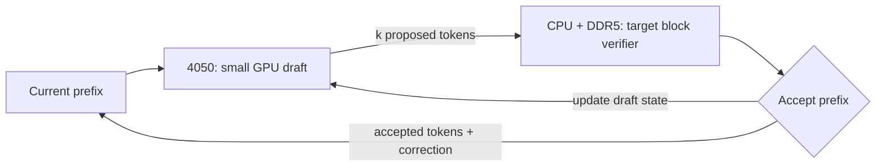

# Chat Transcript: LLM Bandwidth Solution

## User

Autoregressive decoding of offloaded LLMs (e.g., Qwen2.5-Coder-32B or 14B) on consumer hardware (e.g., RTX 4050 6GB + 24GB DDR5) is strictly bounded by dual-channel DDR5 memory bandwidth (~48 GB/s), capping dense 32B single-token decode at ~2.88–3.4 tok/s. No compiler, kernel fusion, or scheduling trick can move weights faster through physical copper traces during sequential Single-Token GEMV.
invent an solution by doing regourous reserch to increase token speed

## Aurelle

> **Exploring innovative solutions**
> 
> I need to acknowledge the fundamental boundaries we face in reducing bytes and tokens. The user is asking for rigorous research, so I think I should search the literature. Maybe I’ll find some relevant information on topics like speculative decoding, layer skipping, or sparse MoE. It sounds like writing an invention proposal could be useful too. I’ll carefully formulate my queries around these terms to gather information effectively!

> **Searched Papers**
> 6 searches · 120 papers · AgentSpec: Speculative Decoding for Batch Inference of LLM Agents · SimSD: Simple Speculative Decoding in Diffusion Language Models · BigMoMo: Efficient Inference of Large-Scale MoE with Speculative Decoding on Mobile Devices · Speculative Probing: LLM Monitoring at Speculative-Decoding Cost · DraftExpert: Expansion-Aware Self-Speculative Decoding for End-Device MoE Inference · Trajectory-Level Speculative Decoding for Diffusion Language Models · Speculative Speculative Decoding · AsymSpec: Context-Asymmetric Speculative Decoding for Agentic LLMs · FlexEE: Self-Speculative and KV-Compatible Early Exiting for Offloading-Aware LLM Inference · S2-MoE: Enabling Efficient Self-Speculative Decoding for Mixture-of-Experts on Edge Devices · A Sparse Glimpse of the Whole: Train-Free Self-Speculative Decoding · FastTPS: An Optimized Method for LLM Token Phase for AI accelerators · Lossless but Not Free: An Empirical Anatomy of Speculative Decoding on Consumer Hardware · Accelerating LLM Inference via Vector Index Based Output Embeddings · HERALD: High-Throughput Block Diffusion LLM Serving via CPU-GPU Cooperative KV Cache Retrieval · CATS: Cascaded Adaptive Tree Speculation for Memory-Limited LLM Inference Acceleration · EVA: Accelerating LLM Decoding via an Efficient Vector Quantization Architecture · DualPath: Breaking the Storage Bandwidth Bottleneck in Agentic LLM Inference · PATTON: Enabling Commodity PIM for Production LLM Serving · AMEND: Audited Margins Enable Nonblocking Drops in GPU-PIM LLM Decoding · On Design Principles for Efficient Heterogeneous DRAM-PIM-GPU Systems · Beyond Truncation: Rethinking LLM Decoding as Ensemble Pruning · LLM Inference in a Flash! · Every Microsecond Matters: Achieving Near Speed-of-Light Latency in GPU Collectives · Automated Tensor Scheduling for Hybrid CPU-GPU LLM Inference on Consumer Devices · HybridGen: Efficient LLM Generative Inference via CPU-GPU Hybrid Computing · DAK: Direct-Access-Enabled GPU Memory Offloading with Optimal Efficiency for LLM Inference · SpecMoE: A Fast and Efficient Mixture-of-Experts Inference via Self-Assisted Speculative Decoding · MoE Expert Execution in Disaggregated LLM Serving with a High-Bandwidth ReRAM Near-Memory Architecture · BOOST: Concurrent Access to Host Memory and HBM to Accelerate LLM Inference · FlashAccel: Leveraging High-Bandwidth Flash (HBF) for High-Throughput LLM Inference · Exploring High-Bandwidth Flash for Modern LLM Inference: Opportunities and Challenges · FLINT: Efficiently Leveraging High Bandwidth Flash for Capacity-Scalable LLM Inference Acceleration · NeuroPrefetcher: Storage-Aware Sparse LLM Inference via Delta Prefetching · A Fast Locality Simulator for GEMM Design-Space Exploration on Multi-Chiplet GPUs

> **Analyzing future papers**
> 
> I’m looking at interesting papers that are valid up to 2026. I think I need to read about two, especially focusing on early exits and pipeline strategies related to native and sparse glimpses. It seems like there’s also a speculative paper that’s known, but it’s not required. The specific question is asking for a robust solution. I’ll need to read these selected papers to get a broader understanding of the topic.

> **Read 3 papers**
> Pipeline-Native Transformers: Co-Designing Model Architecture and CPU Inference for Bandwidth-Efficient Autoregressive Decode · FlexEE: Self-Speculative and KV-Compatible Early Exiting for Offloading-Aware LLM Inference · A Sparse Glimpse of the Whole: Train-Free Self-Speculative Decoding

> **Evaluating formula output**
> 
> I’m examining the expected formula output where I'm considering expected values in relation to the acceptance probability. It seems like I need to calculate \(E[n]\) using parameters like probability, independence, and a summation of terms. The formula \(E[n]=(1-p^{k+1})/(1-p)\) presents a potential calculation to work through, so I’ll ensure I’m thinking clearly about the probability distribution and how the parameters tie into this. There’s much to analyze in this!

> **Evaluating processing sequences**
> 
> I’m thinking about how the CPU outputs probabilities and how acceptance works with random uniform coordination. It looks like GPU-token generation will block until the CPU can verify, which happens in a sequential draft first. Can I pipeline the next round? It seems I can’t start the next sequence until I know the accepted prefix, but I could perhaps pipeline separate requests in batches. A single stream doesn’t seem feasible, yet I still end up with a result.

> **Searched Papers**
> 1 search · 9 papers · [2412.15115] Qwen2.5 Technical Report - arXiv · [2502.13923] Qwen2.5-VL Technical Report - arXiv · [2501.15383] Qwen2.5-1M Technical Report - arXiv · [2503.20215] Qwen2.5-Omni Technical Report - arXiv · [2407.10671] Qwen2 Technical Report - arXiv · Qwen2.5-Math Technical Report: Toward Mathematical Expert ... · Amadeus-Verbo Technical Report: The powerful Qwen2.5 family ... · [2505.09388] Qwen3 Technical Report - arXiv

> **Analyzing CPU and bandwidth limits**
> 
> I’m trying to clarify a predicted goal of 7-11 tokens versus an actual 32 billion? If I have 4.33 and no extra bandwidth, I could get a theoretical 12.5. I want to compute CPU or draft it down to maybe 7-10. This seems more like a hypothesis to test rather than a claim. I should establish a rigorous test threshold and see if it accepts something like greater than or equal to. For twice that, there's a throughput equation I want to run by: C0=W/B.

**Build a GPU-resident draft model plus layer-resident block verifier:** instead of trying to make one dense 32B forward pass faster, stream the 32B target’s weights *once per verified block* of $k$ candidate tokens. That changes the bandwidth cost from roughly one full weight sweep per emitted token to one sweep per roughly $1+\sum_{i=1}^{k}\alpha^i$ emitted tokens, where $\alpha$ is draft-token acceptance probability.

Your bandwidth argument is right for **exact, ordinary single-token decoding of a frozen dense model**. If every token requires a sequential GEMV over all active weights, neither kernel fusion nor CPU scheduling can beat the DRAM traffic lower bound. The only ways out are:

1. reduce bytes read per target decision (quantization, sparsity, early exit), or  
2. get **multiple committed tokens per weight stream**.

I would pursue (2), because it can retain the target model’s output distribution exactly.

## Proposed system: RAM-Streamed Block Verification (RSBV)

Use the RTX 4050’s 6 GB not for target-model layers, but for a small, fast **draft model**—for example, a code-specialized $0.5$–$2$B model in 4-bit precision plus its KV cache. Keep the target [Qwen2.5-Coder](https://www.alphaxiv.org/abs/2409.12186) 14B/32B quantized model in DDR5.



### Per iteration

1. The RTX draft model proposes $k \in \{4,8,12\}$ tokens.
2. The CPU runs the *target* model on all $k$ proposed positions as a causal microbatch.
3. At each target layer, it loads that layer’s quantized weights from DDR5 **once**, then applies them to $k$ activation vectors while the weights are hot in LLC/L2/register-streaming buffers.
4. Standard speculative acceptance/rejection commits the accepted prefix and samples one correction token if necessary.
5. Adapt $k$ online based on actual acceptance and measured draft/verifier time.

The key distinction is that this does **not** claim to accelerate the target’s first-token GEMV. It amortizes the same weight stream across several causally verified positions.

## Why this can beat the 2.9–3.4 tok/s wall

Let:

- $C_w = W/B_{\rm DRAM}$: time to stream target weights once;
- $C_d$: GPU draft time per proposed token;
- $C_c(k)$: extra CPU compute and KV-attention time to verify a $k$-token block;
- $\alpha$: probability that a drafted token is accepted, approximated here as stationary;
- $k$: speculation length.

Expected committed tokens per block is approximately

$$
E[N_{\rm out}] = 1+\sum_{i=1}^{k}\alpha^i
$$

where the extra $1$ is the correction token produced by verification. The approximate speedup over ordinary target decode is

$$
S(k) \approx
\frac{E[N_{\rm out}]\,C_w}
{C_w + kC_d + C_c(k)}.
$$

With $\alpha=0.80$ and $k=8$,

$$
E[N_{\rm out}]
=1+0.8+0.8^2+\cdots+0.8^8
\approx 4.33.
$$

So the *bandwidth-only* ceiling becomes approximately $4.33\times$ your baseline: $2.88 \rightarrow 12.5$ tok/s. Real throughput will be lower because of draft work, block-GEMM compute, and verification attention; a sensible engineering target is **$7$–$10$ tok/s for 32B**, not a promise of $12.5$.

For 14B, the same scheme has a higher baseline and may become compute-limited at larger $k$, so the controller should generally select shorter blocks.

This is not speculative hand-waving: [SparseSpec-L](https://www.alphaxiv.org/abs/2607.27735) formalizes essentially this acceptance/cost tradeoff and reports that longer blocks become counterproductive when marginal acceptance falls below relative draft cost. [Efficiency Analysis](https://www.alphaxiv.org/abs/2607.27735v1?page=3) Its adaptive controller chooses $k$ by maximizing expected committed tokens per measured draft-plus-verification cost. [Adaptive Length](https://www.alphaxiv.org/abs/2607.27735v1?page=5)

## The non-obvious implementation detail: verify *layer-major*, not token-major

Most CPU speculative implementations leave performance on the table by structuring verification like this:

```text
for proposed token j:
    run all L target layers
```

RSBV must structure it as:

```text
for target layer l:
    stream W[l] from DDR5 once
    run W[l] × H[:, 1:k]        # quantized GEMM / multi-vector GEMV
    update causal attention and KV for positions 1:k
```

That ordering makes $W_l$ reusable across the $k$ positions. A regular single-token decoder sees $W_l$ once for each output token; the verifier sees it once for an entire candidate block.

The block is still mathematically valid: causal attention allows the layer to process all proposed positions together, since position $j$ only attends to the prefix and positions $<j$. The target produces exactly the logits needed to verify each candidate.

This also means you should **not** transfer target layers repeatedly over PCIe. If the target weights live in DDR5, evaluate them on CPU; use the 4050 solely for the resident draft. CPU $\leftrightarrow$ GPU activation transfers should be minimized to token IDs, sampled logits/top-$p$ support, and occasional synchronization—not layer-weight traffic.

## Exactness modes

There are two useful modes:

- **Greedy exact mode.** Accept draft tokens only while their IDs equal the target argmax; on the first mismatch, emit the target argmax. This returns the same greedy continuation as dense target decoding.
- **Sampling exact mode.** Use speculative sampling: accept candidate $y$ with probability $\min(1,p(y)/q(y))$, where $p$ is the target distribution and $q$ the draft distribution; on rejection, sample from the residual distribution. This preserves the target’s sampling distribution.

For coding, start with greedy mode. It is simpler, deterministic, and will expose whether the GPU drafter tracks the 14B/32B target well enough on your workloads.

## A practical controller

Do not fix $k=8$. Code has runs of easy tokens—indentation, delimiters, boilerplate, common identifiers—followed by hard tokens where long speculation wastes time.

Maintain, for each candidate position $i$:

- draft entropy $H_i$;
- recent empirical acceptance by entropy bucket;
- observed GPU draft time $C_d$;
- observed target block verification cost $C_c(k)$.

Then select

$$
k^\star =
\arg\max_{k \in \{2,4,6,8,12\}}
\frac{
1+\sum_{m=1}^{k}\prod_{i=1}^{m}\hat p_i
}{
C_w+kC_d+C_c(k)
}.
$$

This is the right decision rule because it chooses the largest block only when the predicted accepted-prefix length pays for drafting it. [SparseSpec-L](https://www.alphaxiv.org/abs/2607.27735) observed a real “efficiency inversion”: increasing a fixed horizon eventually reduced throughput as acceptance decayed. [Fixed Horizon](https://www.alphaxiv.org/abs/2607.27735v1?page=6)

## Optional second stage: confidence-gated depth reduction

Once block verification works, add a **non-exact fast path** for interactive coding:

- train or fine-tune layerwise exits on the target architecture;
- at selected late layers, predict whether the final target argmax is stable;
- if confidence is high, skip the remaining layers and avoid streaming their weights;
- otherwise fall back to full target verification.

This attacks bytes/token directly, rather than merely amortizing them. [FlexEE](https://www.alphaxiv.org/abs/2609.17008) demonstrates why this is especially effective under offloading: an early exit avoids loading the unexecuted layers’ weights, and its hidden-state strategy avoids reconstructing all later KV entries. [KV Management](https://www.alphaxiv.org/abs/2609.17008v1?page=6)

But do not present this mode as exact dense-model decoding. Intermediate exits alter the distribution unless the exit is verified. The relevant measured tradeoff is meaningful: on its evaluated offloading setup, FlexEE exited around layer $24$–$26 of a $32$-layer model while remaining close to dense scores on several tasks. [Open Generation](https://www.alphaxiv.org/abs/2609.17008v1?page=9)

## What I would build first

1. **Baseline profiler:** record target weight-stream time, target compute time, KV-attention time, and DRAM bandwidth for 14B and 32B at contexts 1K, 8K, and 32K.
2. **Resident draft:** fit a code drafter fully on the 4050; optimize for argmax agreement with the target, not standalone benchmark score.
3. **Layer-major verifier:** add a $k$-column quantized GEMM path in the CPU backend. This is the critical component.
4. **Greedy verifier:** measure acceptance, average accepted-prefix length, and end-to-end tok/s at $k=2,4,6,8,12$.
5. **Adaptive controller:** replace fixed $k$ with the measured-cost objective above.
6. **Sampling-correct verifier:** only after greedy mode is profitable.
7. **Optional exit model:** train it only if the speculative system’s acceptance saturates too low.

## Success criteria

For the 32B case, do not call it a win just because a microbenchmark shows a faster matrix multiply. Require:

| Metric | Threshold |
|---|---:|
| Greedy output | Bit-identical to dense target output |
| Average emitted tokens / target weight sweep | $\ge 2.5$ |
| End-to-end 32B speed | $\ge 6$ tok/s |
| Draft GPU utilization | Sustained; no target-weight PCIe shuttling |
| Long-context regression | No throughput collapse at 8K–32K context |
| Sampling mode | Distributionally exact speculative correction |

The core research claim is therefore narrower and defensible: **the DDR5 bound remains absolute for a target-model weight sweep, but it is not an absolute bound on output tokens per second.** A layer-major speculative verifier converts one bandwidth-limited sweep into several exactly committed target tokens, while a 6 GB GPU supplies the cheap proposal stream.